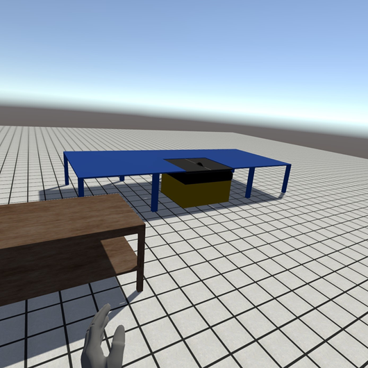

# Workstation Designer

The MODS Workstation Designer is a program for creating virtual representations of factory workstations for simulation in the main MODS application, which is in development a different team at OSU. Together, these tools will help modular construction factory managers and designers prototype the layout of their factory workstations in order to improve efficiency. Specially, these tools will help them visualize the full effect of design changes without needing to physically implement them.

This project is the Oregon State University Senior Software Engineering Project for Curtiss Haldorson, Truman Hess, Matthew Macovsky, and Logan Traffas.

## Setup
1. Install Unity 2020.3.2f1.
2. Clone this repository.
3. Open this repository in Unity with Unity version 2020.3.2f1.
4. In `/Assets/Scenes`, open either `TitleScreen.scene` or `MainScene.scene`. This will allow experimentation in the Unity editor.
5. [Optional] Create C# project files: In the Unity Editor, navigate to `Edit > Preferences > External Tools`, and click the `Regenerate Project Files` button to generate the .csproj files for the project. This allows easy integration of Visual Studio for the C# script development.
6. [Optional] Build the project: In the Unity Editor, navigate to `File > Build And Run` and select a folder to place the built project files.

## Setting up VR

#### Steam VR Devices:
1. Download Steam and the Steam VR app.
2. Run Steam VR.
3. Run the MODS Workstation Designer.
4. Open and existing or new workstation.
5. Enter VR mode either through the UI or by pressing P.
6. Enjoy VR mode.

#### Oculus Devices:
1. Download Steam and the Steam VR app.
2. Make Oculus devices compatible with Steam VR by following this tutorial.
3. Run Steam VR.
4. Run the MODS Workstation Designer Program.
5. Open and existing or new workstation.
6. Enter VR mode either through the UI or by pressing P.
7. Enjoy VR mode.

#### Windows Mixed Reality Devices:
1. Download Steam and the Steam VR app.
2. Download the Steam VR app for Windows Mixed Reality headsets.
3. Run the Steam VR app for WMR.
4. Run the MODS Workstation Designer.
5. Open and existing or new workstation.
6. Enter VR mode either through the UI or by pressing P.
7. Enjoy VR mode.

## Usage

#### Navigating the Workstation
- Use W, A, S, and D to move along the horizontal plane.
- Use Space to ascend and Shift to descend.
- Hold down the left mouse button and drag to rotate the camera.

#### Creating New Substations
1. Double click on a substation name in the sidebar to select it.
2. Mouse over the grid in the workstation to visualize the substation at different locations. The substation will be highlighted red if it cannot be placed at that position.
3. Click to place the substation.

#### Manipulating Placed Substations
Right click on a placed substation to select it and open the context menu.
- Select “Pick Up” to move the substation within the workstation.
- Select “Delete” to remove the substation from the workstation.
- Left- or right-click outside of a substation to exit the context menu.

#### Saving and Loading Workstations
- To save a workstation, select the “Save” or “Save As” option from the “File” drop-down context menu, name your project, and save to the desired directory.
- To load, either select the “Load Workstation” option from the main menu or select File→Open from the toolbar within the designer. Then locate and select your workstation file to load it. 
- To create a new, empty workstation, either select the “Create New Workstation” option from the main menu or select File→New from the toolbar within the designer.
- The application will prompt the user to save or discard unsaved changes when necessary.

#### Tape Measure
- From the “Tools” drop-down context menu, select “Tape Measure”.
- Click on a point in space to measure from that point. Move the cursor to a desired location, and the tape measure will automatically report the distance between the two points.
- Press Escape to close the tape measure tool.

## Exploring the Workstation in VR
- To enter VR, either select VR→Enter VR from the toolbar or press P.
- To exit VR, either open the VR UI and press the “Exit VR” button or press O.
- Navigate the scene using the left controller’s stick.
- Snap your view in 45 degree increments using the right controller’s stick.
- Press the right controller’s trigger button to open the VR UI.
- Press the left controller’s trigger button to interact with the VR UI.

## References
- The VR portion of the project was inspired by the tutorials of [Valem](https://www.youtube.com/channel/UCPJlesN59MzHPPCp0Lg8sLw/videos).
